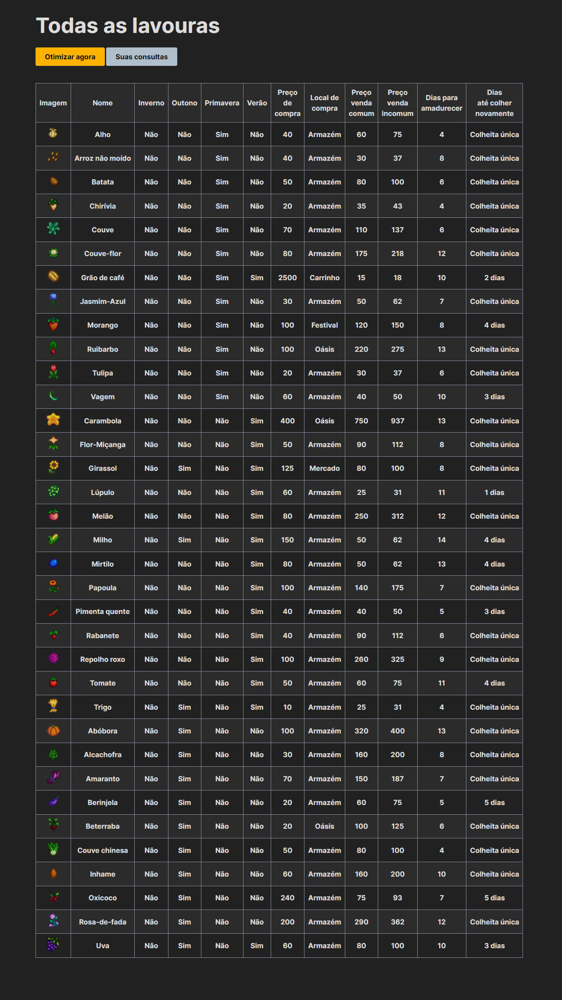
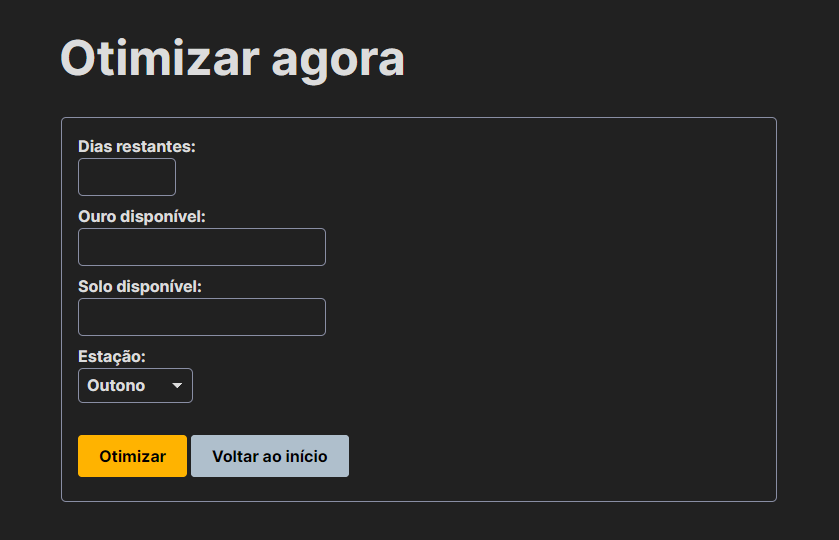
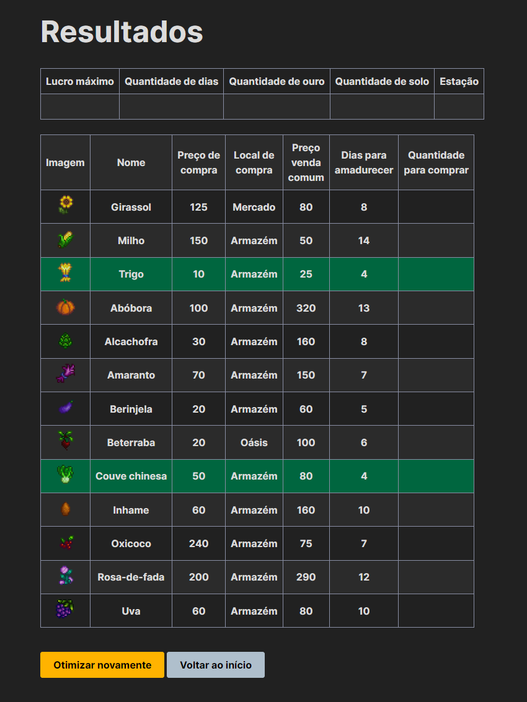
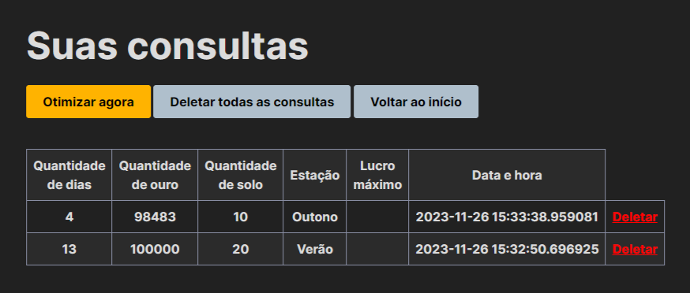

# Stardew Optimizer

## Descrição do Projeto

O **Stardew Optimizer** é uma aplicação web projetada para otimizar a seleção de sementes em Stardew Valley. Ela leva em consideração variáveis como dias restantes na estação, quantidade de ouro disponível, espaço para plantio e a estação atual.

## Tecnologias Utilizadas

### Web Scrapping
- **Pandas**
- **Selenium**
- **Beautiful Soup**
- **Regex**

### Desenvolvimento da Aplicação Web
- **Flask**
- **PostgreSQL** (Banco de Dados)
- **Simple.css** (Framework CSS, versão customizada)
- **Psycopg2**
- **Flask SQL Alchemy**
- **OR-Tools** (para cálculos de otimização)
- **Datetime**

### Justificativas para módulos de bibliotecas

#### Flask
- **Flask:** Inicia e gerencia a aplicação web.
- **render_template:** Retorna as páginas HTML desejadas após cada rota configurada e recebe argumentos quando necessário.
- **send_from_directory:** Cria uma rota que carrega imagens dinamicamente e as exibe nas tabelas.
- **request:** Recupera informações preenchidas pelos usuários no formulário e as guarda em variáveis para processamento posterior.
- **flash:** Mostra avisos para o usuário final no front end.
- **redirect:** Redireciona o usuário após passar por uma rota específica de processamento.
- **url_for:** Lida com rotas e endpoints de forma dinâmica.

#### Flask SQL Alchemy
- **SQLAlchemy:** Conecta-se ao banco de dados PostgreSQL através do Python.
- **desc:** Ordena consultas de forma decrescente.

#### Bibliotecas Adicionais
- **psycopg2:** Utiliza o SQLAlchemy em bancos de dados do tipo PostgreSQL.
- **ortools.linear_solver.pywraplp:** Realiza cálculos de otimização.

#### Bibliotecas Padrão do Python
- **datetime:** Captura a data e hora atual para salvar na tabela de consultas no banco de dados.

## Instruções de Instalação

1. Clone o repositório: `git clone https://github.com/bruno-kalel/stardew_optimizer.git`
2. Execute o script de criação do banco: `script_novo.sql`
3. Instale as bibliotecas necessárias: `pip install flask flask_sqlalchemy psycopg2 ortools`
4. Inicie a aplicação: `python stardew_optimizer.py`
5. Acesse a aplicação em [http://127.0.0.1:5000](http://127.0.0.1:5000)

## Instruções de Uso

**Observação:** Imagens meramente ilustrativas com valores específicos ocultados.

1. Na página inicial, visualize informações sobre as lavouras.

   

2. Preencha o formulário para obter resultados otimizados para o seu cenário.

   

3. Visualize os resultados otimizados para o seu cenário; linhas em verde mostram a(s) semente(s) que você precisa comprar.

   

4. As consultas são armazenadas e podem ser revisitadas ou apagadas.

   

## Estrutura do Projeto

- `/static`: imagens, fontes e CSS customizado.
- `/templates`: templates HTML.
- `dados.ipynb`: documenta o processo de web scrapping.
- `config.py`: contém o processo detalhado de web scrapping utilizado.
- `script_novo.sql`: script de criação do banco de dados.
- `stardew_optimizer.py`: script principal, modelos de conexão com o banco de dados e rotas.

## Contato

Para relatar problemas, fazer perguntas ou contribuir, entre em contato com os desenvolvedores:

- [Bruno K.](https://github.com/bruno-kalel)
- [Rafael M.](https://github.com/gabipasse)
- [Mel L.](https://github.com/melltl)
