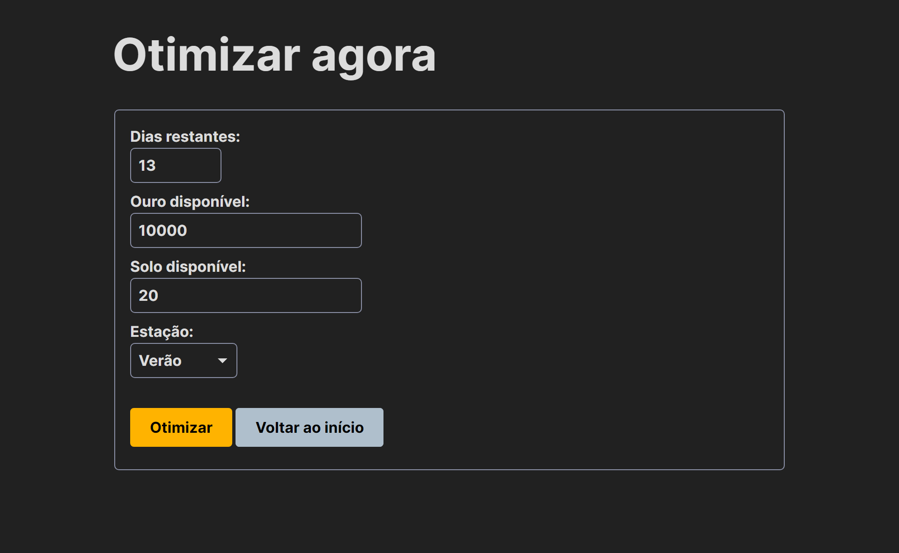
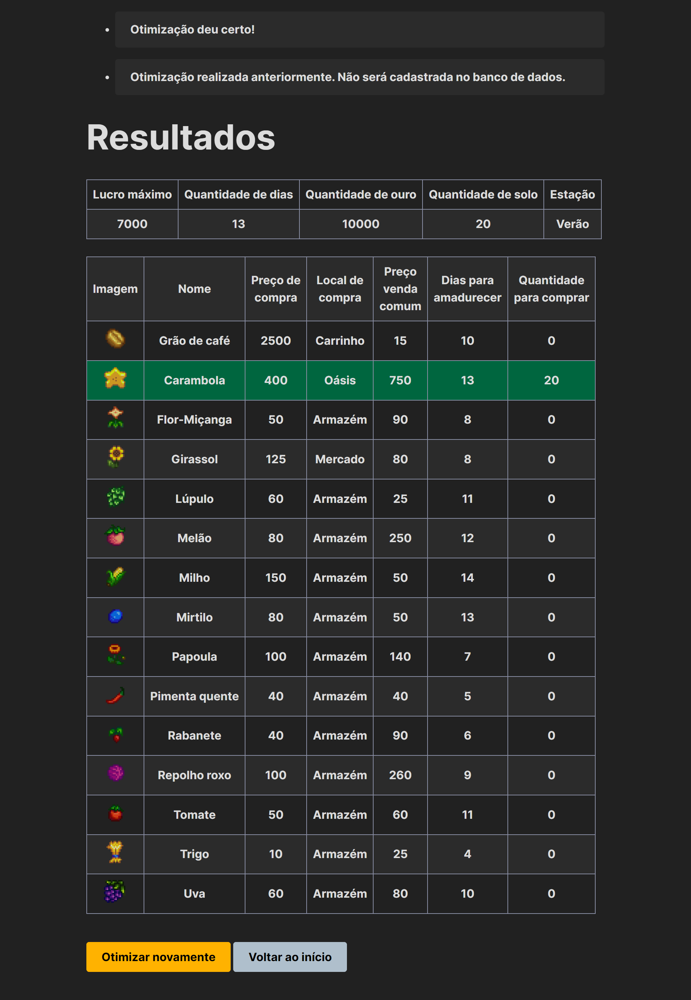
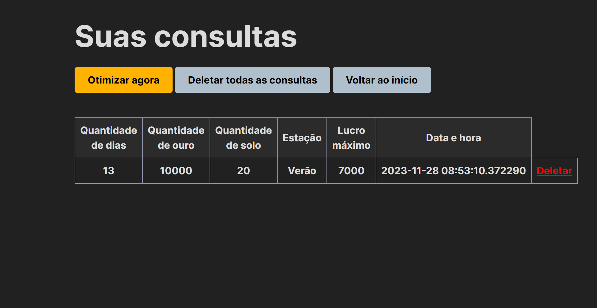

# Stardew Optimizer

## Table of Contents

- [English Version](#english-version)
- [Versão em Português](#versão-em-português)

---

## English Version

### Project Description

The **Stardew Optimizer** is a web application designed to optimize seed selection in Stardew Valley. It considers variables such as remaining days in the season, available gold, planting space, and the current season.

### Table of Contents

- [Technologies Used](#technologies-used)
- [Justification for Library Modules](#justification-for-library-modules)
- [Installation Instructions](#installation-instructions)
- [Usage Instructions](#usage-instructions)
- [Project Structure](#project-structure)
- [Contact](#contact)

### Technologies Used

#### Web Scraping
- **Pandas**
- **Selenium**
- **Beautiful Soup**
- **Unicode**
- **Regex**

#### Web Application Development
- **Flask**
- **PostgreSQL**
- **Simple.css**
- **Psycopg2**
- **Flask SQL Alchemy**
- **OR-Tools**
- **Datetime**

#### Justification for Library Modules

##### Flask
- **Flask:** Manages the web application.
- **render_template:** Returns desired HTML pages after each configured route and receives arguments when necessary.
- **send_from_directory:** Creates a route that dynamically loads and displays images in tables.
- **request:** Retrieves information filled by users in the form and stores it in variables for further processing.
- **flash:** Displays alerts to the end user on the front end.
- **redirect:** Redirects the user after passing through a specific processing route.
- **url_for:** Handles routes and endpoints dynamically.

##### Flask SQL Alchemy
- **SQLAlchemy:** Connects to the PostgreSQL database through Python.
- **desc:** Orders queries in descending order.

##### Psycopg2
- **psycopg2:** Uses SQLAlchemy with PostgreSQL databases.

##### OR-Tools
- **linear_solver.pywraplp:** Performs optimization calculations.

##### Python Standard Libraries
- **datetime:** Captures the current date and time to save in the queries table in the database.

### Installation Instructions

1. Clone the repository: `git clone https://github.com/bruno-kalel/stardew_optimizer.git`
2. Create a PostgreSQL database named `stardew`.
3. Execute the script for creating tables and inserting data into the database: `script_novo.sql`
4. Edit the `config.py` file with the credentials for your PostgreSQL installation.
5. Install the necessary libraries in your Python interpreter: `pip install flask flask_sqlalchemy psycopg2 ortools`
6. Start the application: `python stardew_optimizer.py`
7. Access the application at [http://127.0.0.1:5000](http://127.0.0.1:5000)

### Usage Instructions

**Note:** Images are for illustrative purposes only, with specific values hidden.

1. On the home page, view information about the crops.

   

2. Fill out the form to get optimized results for your scenario.

   

3. View the optimized results for your scenario; rows in green show the seed(s) you need to buy.

   

4. Queries are stored and can be revisited or deleted.

   

### Project Structure

- `/assets`: Images used in this README.
- `/static`: Images, fonts, and custom CSS used in the application.
- `/templates`: HTML templates.
- `dados.ipynb`: Jupyter Notebook documenting the web scraping process.
- `config.py`: Configuration file for the database connection.
- `script_novo.sql`: Script for creating tables and inserting into PostgreSQL.
- `stardew_optimizer.py`: Main script, database connection models, and routes.

### Contact

To report issues, ask questions, or contribute, contact the developers:

- [Bruno K.](https://github.com/bruno-kalel)
- [Rafael M.](https://github.com/gabipasse)
- [Mel L.](https://github.com/melltl)

---

## Versão em Português

### Descrição do Projeto

O **Stardew Optimizer** é uma aplicação web projetada para otimizar a seleção de sementes em Stardew Valley. Ela leva em consideração variáveis como dias restantes na estação, quantidade de ouro disponível, espaço para plantio e a estação atual.

### Índice

- [Tecnologias Utilizadas](#tecnologias-utilizadas)
- [Justificativas para Módulos de Bibliotecas](#justificativas-para-módulos-de-bibliotecas)
- [Instruções de Instalação](#instruções-de-instalação)
- [Instruções de Uso](#instruções-de-uso)
- [Estrutura do Projeto](#estrutura-do-projeto)
- [Contato](#contato)

### Tecnologias Utilizadas

#### Web Scrapping
- **Pandas**
- **Selenium**
- **Beautiful Soup**
- **Unicode**
- **Regex**

#### Desenvolvimento da Aplicação Web
- **Flask**
- **PostgreSQL**
- **Simple.css**
- **Psycopg2**
- **Flask SQL Alchemy**
- **OR-Tools**
- **Datetime**

#### Justificativas para Módulos de Bibliotecas

##### Flask
- **Flask:** Inicia e gerencia a aplicação web.
- **render_template:** Retorna as páginas HTML desejadas após cada rota configurada e recebe argumentos quando necessário.
- **send_from_directory:** Cria uma rota que carrega imagens dinamicamente e as exibe nas tabelas.
- **request:** Recupera informações preenchidas pelos usuários no formulário e as guarda em variáveis para processamento posterior.
- **flash:** Mostra avisos para o usuário final no front end.
- **redirect:** Redireciona o usuário após passar por uma rota específica de processamento.
- **url_for:** Lida com rotas e endpoints de forma dinâmica.

##### Flask SQL Alchemy
- **SQLAlchemy:** Conecta-se ao banco de dados PostgreSQL através do Python.
- **desc:** Ordena consultas de forma decrescente.

##### Psycopg2
- **psycopg2:** Utiliza o SQLAlchemy em bancos de dados do tipo PostgreSQL.

##### OR-Tools
- **linear_solver.pywraplp:** Realiza cálculos de otimização.

##### Bibliotecas Padrão do Python
- **datetime:** Captura a data e hora atual para salvar na tabela de consultas no banco de dados.

### Instruções de Instalação

1. Clone o repositório: `git clone https://github.com/bruno-kalel/stardew_optimizer.git`
2. Crie um banco de dados postgresql com o nome `stardew`
2. Execute o script de criação de tabelas e inserção na query do banco de dados: `script_novo.sql`
3. Edite o arquivo `config.py` com as credenciais da sua instalação do PostgreSQL.
3. Instale as bibliotecas necessárias no seu interpretador Python: `pip install flask flask_sqlalchemy psycopg2 ortools`
4. Inicie a aplicação: `python stardew_optimizer.py`
5. Acesse a aplicação em [http://127.0.0.1:5000](http://127.0.0.1:5000)

### Instruções de Uso

**Observação:** Imagens meramente ilustrativas com valores específicos ocultados.

1. Na página inicial, visualize informações sobre as lavouras.

   

2. Preencha o formulário para obter resultados otimizados para o seu cenário.

   

3. Visualize os resultados otimizados para o seu cenário; linhas em verde mostram a(s) semente(s) que você precisa comprar.

   

4. As consultas são armazenadas e podem ser revisitadas ou apagadas.

   

### Estrutura do Projeto

- `/assets`: imagens utilizadas aqui no README.
- `/static`: imagens, fontes e CSS customizado.
- `/templates`: templates HTML.
- `dados.ipynb`: Jupyter Notebook que possui o histórico do processo de web scrapping.
- `config.py`: arquivo de configuração da conexão com o banco de dados.
- `script_novo.sql`: script de criação do banco de dados.
- `stardew_optimizer.py`: contém o script principal, os modelos de conexão com o banco de dados e as rotas.

### Contato

Para relatar problemas, fazer perguntas ou contribuir, entre em contato com os desenvolvedores:

- [Bruno K.](https://github.com/bruno-kalel)
- [Rafael M.](https://github.com/gabipasse)
- [Mel L.](https://github.com/melltl)
